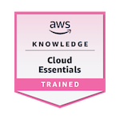
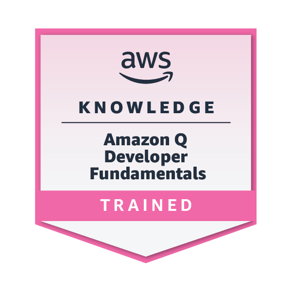

### Hi there! 👋

Welcome to my GitHub!  
Here you will find my projects and somethings I have been coding for studying purposes, or just for fun 😄

___

### About me

I have been programming since 2000, when I took my first programming course, and have been a professional programmer since 2004. 
Over the years I learned (and forgot :stuck_out_tongue_closed_eyes:) a few programming languages, like Clipper, Pascal, Visual Basic, Delphi, ASP, ColdFusion, C and C++ (you won't find anything written on those languages here though). Nowadays I mostly use Java, PHP and SQL, I am trying to learn JavaScript in order to be able to create a full application and I am also studying Haskell (functional programming:bangbang:) beacause it is fun.
During my career I have worked on several different projects, from a simple website to fighter aircrafts software, here goes a list of the ones I am prouder of:
 
 :heavy_check_mark: Maintenance system for the C-390 Millenium aircraft.
 :heavy_check_mark: Airspace and air traffic management simulation system.
 :heavy_check_mark: Computer based training system for the Gripen E/F fighter aircraft.
 :heavy_check_mark: Air traffic statistical software.
 :heavy_check_mark: Tax bookkeeping software used by several towns in Brazil.
 :heavy_check_mark: Air traffic control service charging software for Venezuela.
 
 In my spare time I like playing video games :video_game:, listening to metal music :guitar:, watching movies and series :tv: and practicing wing chun :wrestling:. 

___

### Badges

___

<!--
In my spare time I like playing video games (:video_game:), listening to metal (:guitar:), watching movies and series (:tv:) and practicing wing chun. 
-->

<!--
**EderColoma/EderColoma** is a ✨ _special_ ✨ repository because its `README.md` (this file) appears on your GitHub profile.

Here are some ideas to get you started:

- 🔭 I’m currently working on ...
- 🌱 I’m currently learning ...
- 👯 I’m looking to collaborate on ...
- 🤔 I’m looking for hel,p with ...
- 💬 Ask me about ...
- 📫 How to reach me: ...
- 😄 Pronouns: ...
- ⚡ Fun fact: ...
-->

